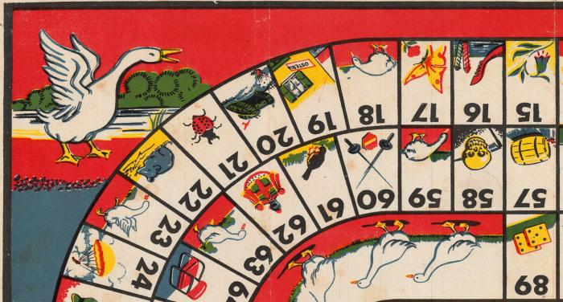

# Gioco dell'Oca (su Leopardi)

Il gioco dell'oca è un classico fra i giochi da tavolo. La nostra versione è una semplice app con un tema
abbastanza inusuale: la vita e le opere di Giacomo Leopardi.

Con questo software la classe 4BS ha partecipato al concorso **Un gioco per Giacomo** (PS: sono una forza a inventare nomi di concorsi)

Se non hai mai sentito parlare del gioco dell'oca (o di Leopardi) probabilmente sei appena atterrato sul nostro Pianeta: sappi allora che esiste una enciclopedia libera online abbastanza fornita:

* [Link sul gioco dell'oca](https://it.wikipedia.org/wiki/Gioco_dell%27oca)

* [Link su Giacomo Leopardi](https://it.wikipedia.org/wiki/Giacomo_Leopardi)

